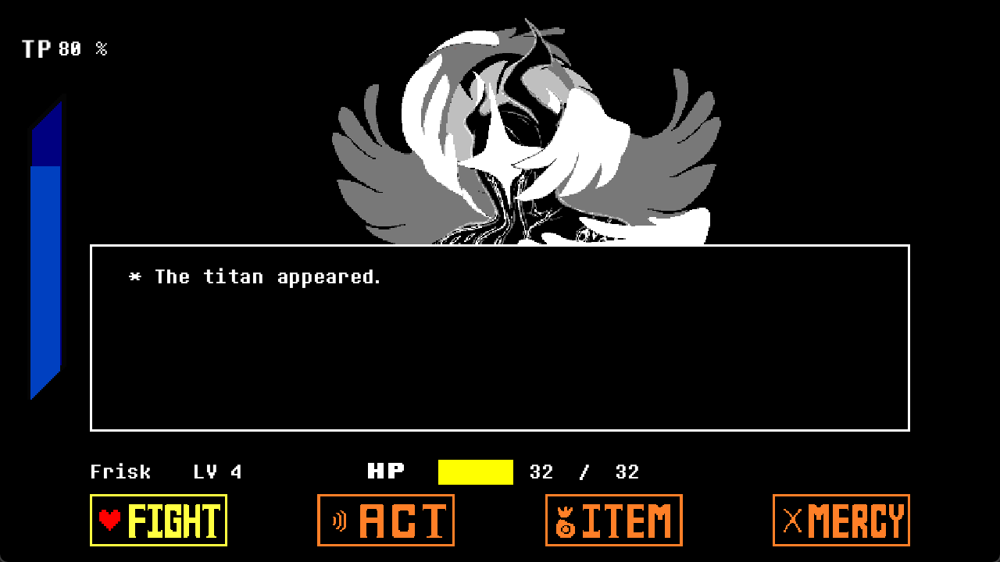
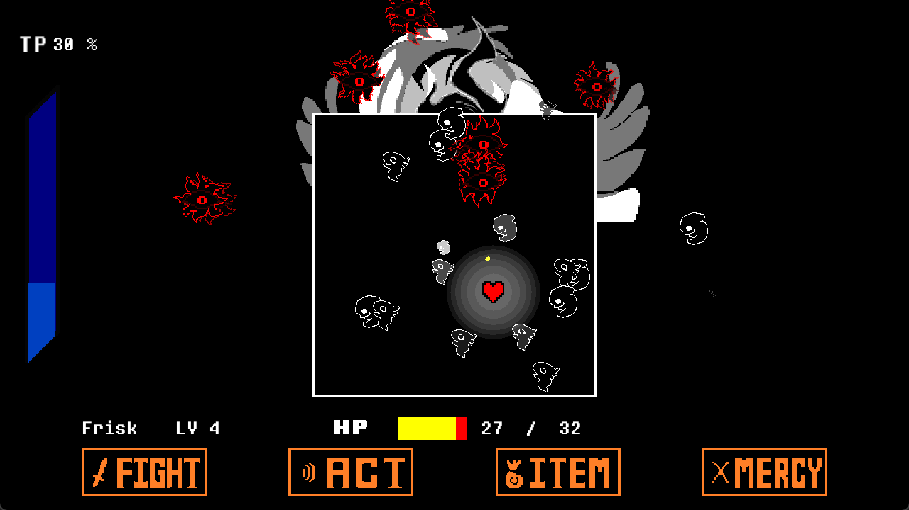

# 🎮 Java Undertale — Titan 战斗系统

> 基于 **LWJGL 3** 的 Java 同人游戏项目，复现《Deltarune》第四章 Titan 战斗场景。  
> 采用多种设计模式进行架构设计，支持三档难度选择。

---

## 📸 游戏截图

  
  

---

## ✨ 核心特性

- ⚔️ **完整战斗系统** — 回合制战斗，包含蜂群、蛇形、手指、特殊攻击等多种弹幕模式
- 🎯 **三档难度** — SIMPLE / NORMAL / HARD，影响弹幕速度、伤害、Boss 血量等参数
- 🎨 **场景管理** — 基于单例 + 工厂模式的场景切换系统（开始菜单 → 难度选择 → 战斗 → 结算）
- 🧩 **状态模式 UI** — 战斗菜单采用状态模式，消除大型 switch，每个状态独立可测试
- 🔊 **音效系统** — OpenAL 音效支持（背景音乐、攻击音效等）
- 💾 **存档系统** — 支持游戏进度保存与读取
- 🎬 **动画系统** — 基于 Builder 模式的动画构建器

---

## 🏗️ 项目结构

`
java-undertale-master/
├── src/main/java/undertale/
│   ├── Animation/          # 动画系统
│   ├── Enemy/              # 敌人系统（Titan、弹幕等）
│   ├── GameObject/         # 游戏对象（Player、Bullet、Collectable等）
│   ├── Scene/              # 场景系统
│   │   └── Rounds/         # 回合系统（Swarm/Snake/Finger/Special）
│   ├── UI/                 # UI 系统
│   │   └── state/          # 状态模式实现
│   └── Utils/              # 工具类（难度管理、存档、配置等）
├── src/main/resources/     # 游戏资源（图片、音效、着色器）
├── src/test/java/          # 单元测试
├── img/                    # 文档用截图
├── doc/                    # 设计文档 & UML 图
└── pom.xml                 # Maven 配置
`

---

## 🛠️ 技术栈

| 技术                 | 用途      |
| -------------------- | --------- |
| **JDK 21**           | 运行环境  |
| **Maven 3.6+**       | 构建工具  |
| **LWJGL 3.3.6**      | 游戏引擎  |
| **Gson 2.8.9**       | JSON 配置 |
| **JUnit 5.9.3**      | 单元测试  |
| **Launch4j (Maven)** | EXE 打包  |

---

## 🚀 快速开始

### 环境要求

- **JDK 21** 或更高版本
- **Maven 3.6** 或更高版本
- Windows 操作系统（LWJGL natives 配置为 
atives-windows）

### 构建 & 运行

`ash
# 1. 克隆仓库
git clone https://github.com/yolushika/Undertale-Final-Fight.git
cd java-undertale

# 2. 编译打包（自动生成 exe / jar / 依赖）
mvn package

# 3. 运行（三选一）
./target/mygame.exe                                  # Windows 可执行文件
java -jar target/undertale-1.0-SNAPSHOT.jar          # JAR 运行
# 或在 IDEA / VS Code 中直接运行 Main.java
`

---

## 🎮 操作说明

| 按键      | 功能               |
| --------- | ------------------ |
| **方向键** | 移动玩家 / 选择菜单 |
| **Z**     | 确认               |
| **X**     | 取消 / 返回        |
| **ESC**   | 长按退出游戏       |
| **SHIFT** | 减速移动           |

---

## 🧩 设计模式

本项目作为**设计模式课程期末项目**进行了架构重构，应用了以下设计模式：

| 设计模式       | 应用位置                            | 作用               |
| -------------- | ----------------------------------- | ------------------ |
| **单例模式**   | SceneManager, DifficultyManager | 全局唯一实例管理   |
| **工厂模式**   | SceneFactory, StateFactory      | 对象创建解耦       |
| **状态模式**   | MenuState 体系                    | 消除大型 switch    |
| **模板方法**   | Round 抽象类                      | 回合骨架定义       |
| **观察者模式** | InputObserver                     | 输入事件分发       |
| **Builder**    | AnimationBuilder, TextureBuilder | 链式构建复杂对象   |

---

## 📊 难度系统

| 参数           | SIMPLE  | NORMAL | HARD   |
| -------------- | ------- | ------ | ------ |
| 弹幕速度倍率   | 0.7x    | 1.0x   | 1.0x   |
| 弹幕伤害倍率   | 0.7x    | 1.0x   | 1.0x   |
| Boss 血量倍率   | 0.6x    | 1.0x   | 1.25x  |
| TP 获取倍率    | 5.0x    | 1.0x   | 2.0x   |
| 弹幕生成间隔   | 2.0x    | 1.0x   | 0.7x   |
| 玩家初始血量   | 32      | 32     | **64** |
| 初始物品数量   | 8       | 8      | **12** |

---

## 📝 重构亮点

在课程期末阶段，对原始代码进行了大规模重构：

- **UI 系统重构**：将 UIManager 中 500+ 行的巨型 switch 重构为**状态模式**，每个菜单状态独立为 30-50 行的小类
- **难度系统新增**：通过枚举 + 管理器模式，实现难度参数化配置，新增难度只需扩展枚举值
- **场景系统解耦**：引入工厂模式统一创建场景，SceneManager 单例管理场景生命周期

---

## 📄 许可证

本项目为学术课程作品，仅供学习参考。原始游戏《Undertale》及《Deltarune》版权归 Toby Fox 所有。

---

## 👤 作者

- **GitHub**：[yolushika](https://github.com/yolushika)
- **项目链接**：[https://github.com/yolushika/java-undertale](https://github.com/yolushika/Undertale-Final-Fight)

